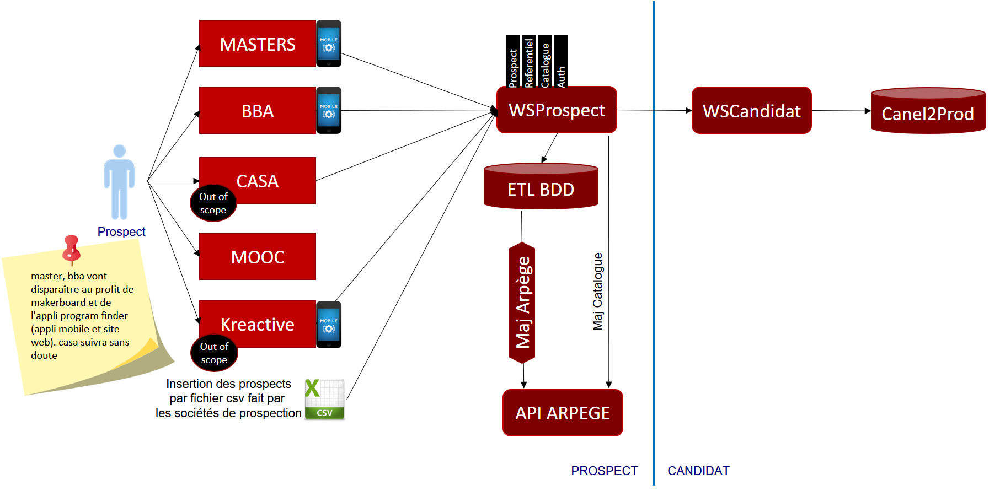

[< Precedent](./0000-index.md) | [Table des matières](./9999-toc.md) | [Suivant >](./0400-archiTechnique.md)

# Vue Fonctionnelle

L’application [Application] permet aux xxx de xxx.

##	Diagramme de contexte

##	Architecture Fonctionnelle

[< Precedent](./0000-index.md) | [Table des matières](./9999-toc.md) | [Suivant >](./0400-archiTechnique.md)
