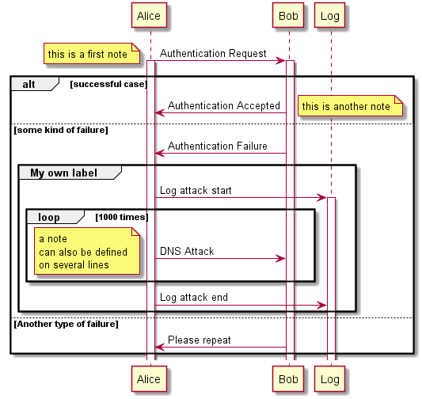

[< Précédent](./0500-baseDonnees.md) | [Table des matières](./9999-toc.md) | [Suivant >](./0700-batchs.md)

# Interfaces / Services

## Interface [Interface #1]

### Description

### Diagrammes de séquence

### Logique avec règles métiers et techniques

### Gestion des erreurs

## Interface [Interface #2]

[< Précédent](./0500-baseDonnees.md) | [Table des matières](./9999-toc.md) | [Suivant >](./0700-batchs.md)
