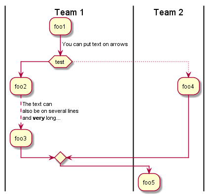

[< Précédent](./0600-interfacesServices.md) | [Table des matières](./9999-toc.md) | [Suivant >](./0800-interfacesUtilisateurs.md)

# Batch Jobs

## Traitement [Traitement #1]

###	Description

###	Fréquence et Mode d’Exécution

###	Description des Entrées et des Sorties

###	Description du Processus de Traitement de Logs

[ajouter la description du processus]

### Description du processus de Gestion d’Erreur

[< Précédent](./0600-interfacesServices.md) | [Table des matières](./9999-toc.md) | [Suivant >](./0800-interfacesUtilisateurs.md)
