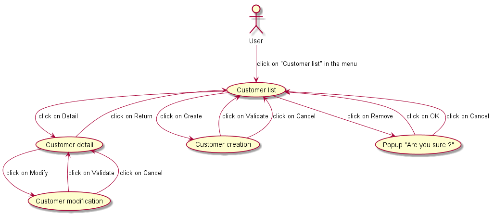

[< Précédent](./0700-batchs.md) | [Table des matières](./9999-toc.md) | [Suivant >](./0900-environnement.md)

#	Interfaces Utilisateurs

## Story board

[insérer schéma de enchainement entre écrans, action possible sur la flèche]

## Ecran [Nom Ecran #1]

###	Description

###	Acteurs

###	Mapping de l’écran

[insérer copie écran, mettre un Id sur chaque chaque champs dans l'écran, qui sera décrit dans le tableau ci dessous]

| Id | Type | Obligatoire (O /N) | Description | Valeurs possible | Source de Données |
|----|------|--------------------|-------------|------------------|-------------------|
|    |      |                    |             |                  |                   |

### Règles métiers et techniques

### Gestion des erreurs

## Ecran [Nom Ecran #2]

[< Précédent](./0700-batchs.md) | [Table des matières](./9999-toc.md) | [Suivant >](./0900-environnement.md)
