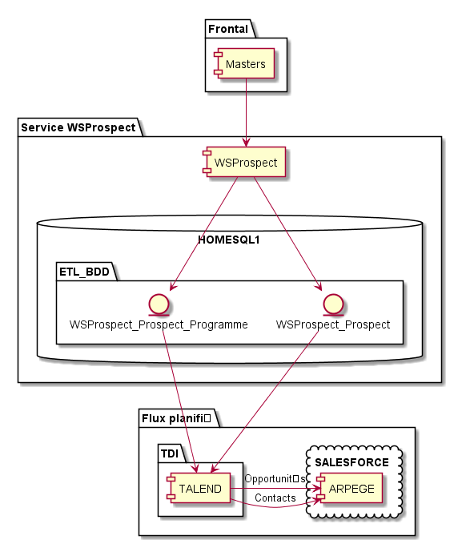

[< Precedent](./100-vueFonctionnelle.md) | [Table des matières](./999-toc.md) | [Suivant >](./300-baseDonnees.md)

# Architecture Technique Générale

## Architecture applicative

## Architecture Opérationnel

##	Plateforme Technique

|     Type                           |     OS/Plateforme      |     Logiciel         |     Version        |
|------------------------------------|------------------------|----------------------|--------------------|
|    Serveur Web                     |    Windows             |    IIS               |    7               |
|    Serveur d’application           |    Windows             |    IIS               |    7               |
|    Serveur de base de données      |    Windows Server      |    SQL Server        |    2008            |
|    Serveur FTP                     |    Linux               |    N/A               |    N/A             |
|    Serveur LDAP                    |    Windows             |    N/A               |    N/A             |
|    Langage                         |    C#                  |    .NET              |    4.0             |
|    Outils Développement            |    Windows 7           |    Visual Studio     |    2010 > 2012     |
|    Outils tests                    |                        |                      |                    |
|    SCM (Gestion de code source)    |    Windows             |    GitLab            |                    |
|    Outils Integration Continu      |                        |                      |                    |

##	Authentication et Authorization
L’authentification des appels Web service se fait par jeton, ceux-ci sont générés par Intercom.

##	Gestion d’Erreur
Les erreurs sont gérées par les codes retour HTTP. Il n’y a pas de page d’erreur personnalisée pour l’application.

##	Logging
Les configurations des logs et des rotation log est gérée avec Log4Net.
Le niveau des logs en Production est Info

Ci-dessous  la configuration actuelle :  

##	Caching
N/A (pas d’utilisation de cache pour cette application)

##	Transaction Management
L’application requière un contexte par transaction. Les transactions sont gérées par Entity Framework

##	Autres Eléments Techniques

[< Precedent](./100-vueFonctionnelle.md) | [Table des matières](./999-toc.md) | [Suivant >](./300-baseDonnees.md)
