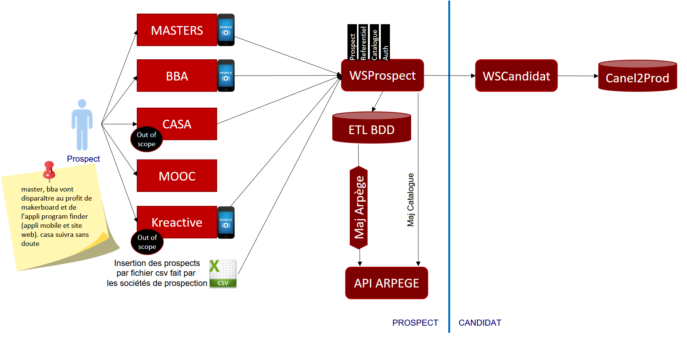
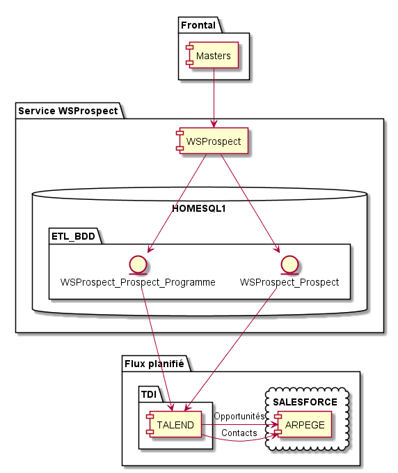
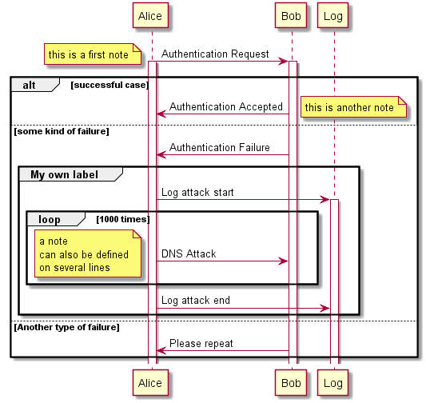
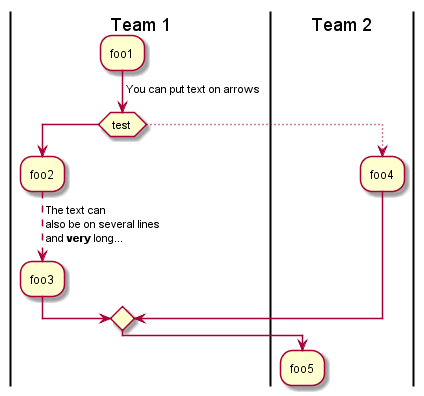

[Table des matières](./9999-toc.md) | [Suivant >](./0300-vueFonctionnelle.md)

# Application Information Document (AID) [Nom Application]

Version: x.y  
Date : dd/mm/yyyy  
Status: Draft  
[Version PDF](./site.pdf)  

## Historique des modifications
| Version | Date       | Auteur        | Description de la modification |
|---------|------------|---------------|--------------------------------|
| x.y     | dd/mm/yyyy | [Auteur]      | Version initiale               |        

> Note :
Date  : Cette date est la date de fourniture de documents après les  revues.
Des changements cosmétiques peuvent être publiés sans revue. Ceci peut engendrer un changement de date sans modifier le numéro de version.

> Numéro de version : C’est le numéro d'identification de document. Pour la version provisoire, le numéro initial commence par 0.1.  Pour la version de base, le numéro de version commence par 1.0, puis incrémenté par 1 toutes les fois que la révision est passée en revue et validée  par les groupes impactés.

## Auteurs
| Rôle        | Nom           | Société |
|-------------|---------------|---------|
| [Rôle]      | [Auteur]      | IBM     |

## Révisions
Ce document a été revu par les personnes suivantes :

| Rôle        | Nom           | Société |
|-------------|---------------|---------|
| [Rôle]      | [Auteur]      | IBM     |

## Approbations
Ce document a été approuvé par les personnes suivantes :

| Rôle        | Nom           | Société |
|-------------|---------------|---------|
| [Rôle]      | [Auteur]      | IBM     |

## Table des matières

- [Objectifs](./0000-index.md#objectifs)
- [Terminologie et Acronymes](./0000-index.md#terminologie-et-acronymes)
- [Vue Fonctionnelle](./0300-vueFonctionnelle.md)
- [Architecture Technique Général](./0400-archiTechnique.md)
- [Bases de Donnees et Dossiers](./0500-baseDonnees.md)
- [Interfaces / services](./0600-interfacesServices.md)
- [Batch Jobs](./0700-batchs.md)
- [Interfaces Utilisateurs](./0800-interfacesUtilisateurs.md)
- [Environnement](0900-environnement.md)
- [Procedure De Deploiment](./1000-procedureDeploiement.md)
- [Activites Périodiques](./1100-activitesPeriodiques.md)
- [Procédure De Backup](./1200-procedureDeBackup.md)
- [Normes Et Conventions](./1300-normesEtConventions.md)
- [Historique De l'Application](./1400-historiqueApplication.md)
- [Documents De Référence](./1500-documentsReference.md)

#	Objectifs

L'objectif du document descriptif d’application (AID) est de fournir aux membres de l'équipe une vue d'ensemble de l'application [Application]. L'AID décrit la fonction de l'application, la structure des applications, la configuration de l’application et l'environnement technique. Ce document pourra faire référence à n'importe quelle documentation existante.
L'équipe de delivery tiendra l'AID à jour durant toute la vie de l'application WS Prospect.

# Terminologie et Acronymes
Les acronymes et la terminologie spécifiquement utilisés dans ce document sont décrits ci-dessous.  D'autres acronymes utilisés généralement peuvent être trouvés dans l'ASCP.

| Numéro       |     Terminologie/acronymes	Définition     |        Définition |
| :------------: | :-------------: | :-------------: |
| 1       |     AID     |        Document descriptif d’application |
| 2       |     SME     |        Expert applicatif |

[Table des matières](./9999-toc.md) | [Suivant >](./0300-vueFonctionnelle.md)
[< Précédent](./0000-index.md) | [Table des matières](./9999-toc.md) | [Suivant >](./0400-archiTechnique.md)

# Vue Fonctionnelle

L’application [Application] permet aux xxx de xxx.

##	Diagramme de contexte

[insérer diagramme de contexte]

##	Architecture Fonctionnelle

[insérer schéma architecture fonctionnelle]

[< Précédent](./0000-index.md) | [Table des matières](./9999-toc.md) | [Suivant >](./0400-archiTechnique.md)
[< Précédent](./0300-vueFonctionnelle.md) | [Table des matières](./9999-toc.md) | [Suivant >](./0500-baseDonnees.md)

# Architecture Technique Générale

## Architecture applicative

[insérer schéma architecture applicative]

## Architecture Opérationnel

[insérer schéma architecture opérationnel]

##	Plateforme Technique

|     Type                           |     OS/Plateforme      |     Logiciel         |     Version        |
|------------------------------------|------------------------|----------------------|--------------------|
|    Serveur Web                     |    Windows             |    IIS               |    7               |
|    Serveur d’application           |    Windows             |    IIS               |    7               |
|    Serveur de base de données      |    Windows Server      |    SQL Server        |    2008            |
|    Serveur FTP                     |    Linux               |    N/A               |    N/A             |
|    Serveur LDAP                    |    Windows             |    N/A               |    N/A             |
|    Langage                         |    C#                  |    .NET              |    4.0             |
|    Outils Développement            |    Windows 7           |    Visual Studio     |    2010 > 2012     |
|    Outils tests                    |                        |                      |                    |
|    SCM (Gestion de code source)    |    Windows             |    GitLab            |                    |
|    Outils Integration Continu      |                        |                      |                    |

##	Authentication et Authorization
L’authentification des appels Web service se fait par jeton, ceux-ci sont générés par Intercom.

##	Gestion d’Erreur
Les erreurs sont gérées par les codes retour HTTP. Il n’y a pas de page d’erreur personnalisée pour l’application.

##	Logging
Les configurations des logs et des rotation log est gérée avec Log4Net.
Le niveau des logs en Production est Info

Ci-dessous  la configuration actuelle :  

##	Caching
N/A (pas d’utilisation de cache pour cette application)

##	Transaction Management
L’application requière un contexte par transaction. Les transactions sont gérées par Entity Framework

##	Autres Eléments Techniques

[< Précédent](./0300-vueFonctionnelle.md) | [Table des matières](./9999-toc.md) | [Suivant >](./0500-baseDonnees.md)
[< Précédent](./0400-archiTechnique.md) | [Table des matières](./9999-toc.md) | [Suivant >](./0600-interfacesServices.md)

# Base de données

## Modèle

[insérer schéma modèle de donnée]

## Autres Fichiers/Répertoire

## Triggers

## Procédures stockées

## Extraction de données

[< Précédent](./0400-archiTechnique.md) | [Table des matières](./9999-toc.md) | [Suivant >](./0600-interfacesServices.md)
[< Précédent](./0500-baseDonnees.md) | [Table des matières](./9999-toc.md) | [Suivant >](./0700-batchs.md)

# Interfaces / Services

## Interface [Interface #1]

### Description

### Diagrammes de séquence

[ajouter la description du digramme de séquence]

### Logique avec règles métiers et techniques

[ajouter la description de règle métiers complexe utilisé dans le diagramme de sequence]

### Gestion des erreurs

[ajouter code erreurs de retour]

### Processus

[ajouter la description du processus]

## Interface [Interface #2]

[< Précédent](./0500-baseDonnees.md) | [Table des matières](./9999-toc.md) | [Suivant >](./0700-batchs.md)
[< Précédent](./0600-interfacesServices.md) | [Table des matières](./9999-toc.md) | [Suivant >](./0800-interfacesUtilisateurs.md)

# Batch Jobs

## Traitement [Traitement #1]

###	Description

###	Fréquence et Mode d’Exécution

###	Description des Entrées et des Sorties

###	Description du Processus de Traitement de Logs

[ajouter la description du processus]

### Description du processus de Gestion d’Erreur

[< Précédent](./0600-interfacesServices.md) | [Table des matières](./9999-toc.md) | [Suivant >](./0800-interfacesUtilisateurs.md)
[< Précédent](./0700-batchs.md) | [Table des matières](./9999-toc.md) | [Suivant >](./0900-environnement.md)

#	Interfaces Utilisateurs

## Story board

[insérer schéma de enchainement entre écrans, action possible sur la flèche]

## Ecran [Nom Ecran #1]

###	Description

###	Acteurs

###	Mapping de l’écran

[insérer copie écran, mettre un Id sur chaque chaque champs dans l'écran, qui sera décrit dans le tableau ci dessous]

| Id | Type | Obligatoire (O /N) | Description | Valeurs possible | Source de Données |
|----|------|--------------------|-------------|------------------|-------------------|
|    |      |                    |             |                  |                   |

### Règles métiers et techniques

### Gestion des erreurs

## Ecran [Nom Ecran #2]

[< Précédent](./0700-batchs.md) | [Table des matières](./9999-toc.md) | [Suivant >](./0900-environnement.md)
[< Précédent](./0800-interfacesUtilisateurs.md) | [Table des matières](./9999-toc.md) | [Suivant >](./1000-procedureDeploiement.md)

# Environnement

[< Précédent](./0800-interfacesUtilisateurs.md) | [Table des matières](./9999-toc.md) | [Suivant >](./1000-procedureDeploiement.md)
[< Précédent](./0900-environnement.md) | [Table des matières](./9999-toc.md) | [Suivant >](./1100-activitesPeriodiques.md)

# Procédure de Deploiement

Compilation en recette, copie du zip   et coller dans le répertoire sur le serveur de production. 

[< Précédent](./0900-environnement.md) | [Table des matières](./9999-toc.md) | [Suivant >](./1100-activitesPeriodiques.md)
[< Précédent](./1000-procedureDeploiement.md) | [Table des matières](./9999-toc.md) | [Suivant >](./1200-procedureDeBackup.md)

# Activités Périodiques

Pas d’activité périodique critique les inscriptions/candidatures peuvent se faire tout au long de l’année. 

[< Précédent](./1000-procedureDeploiement.md) | [Table des matières](./9999-toc.md) | [Suivant >](./1200-procedureDeBackup.md)
[< Précédent](./1100-activitesPeriodiques.md) | [Table des matières](./9999-toc.md) | [Suivant >](./1300-normesEtConventions.md)

# Procedure De Backup

[a préciser emplacement ,  procédure de restauration…]

-	Un backup de la base de données est effectué tous les jours.
-	Les codes sources des projets sont gérés et sauvegardés via GitLab
-	Slp-Wpapp03 …/espace programme/wspROSPECT

[< Précédent](./1100-activitesPeriodiques.md) | [Table des matières](./9999-toc.md) | [Suivant >](./1300-normesEtConventions.md)
[< Précédent](./1200-procedureDeBackup.md) | [Table des matières](./9999-toc.md) | [Suivant >](./1400-historiqueApplication.md)

# Normes Et Conventions

[< Précédent](./1200-procedureDeBackup.md) | [Table des matières](./9999-toc.md) | [Suivant >](./1400-historiqueApplication.md)
[< Précédent](./1300-normesEtConventions.md) | [Table des matières](./9999-toc.md) | [Suivant >](./1500-documentsReference.md)

# Historique De L Application

## Problèmes typiques

## Historique des releases
[à préciser  avec un personne de l’équipe  TMA]

## Histoire de maintenance
[à préciser  avec un personne de l’équipe TMA]

## Interlocuteurs privilégiés  

[< Précédent](./1300-normesEtConventions.md) | [Table des matières](./9999-toc.md) | [Suivant >](./1500-documentsReference.md)
[< Précédent](./1400-historiqueApplication.md) | [Table des matières](./9999-toc.md)

#	Documents De Reference

| Nom des documents   | Stockage des documents | Version | Dernière mise à jour |
|---------------------|------------------------|---------|----------------------|
|                     |                        |         |                      |

[< Précédent](./1400-historiqueApplication.md) | [Table des matières](./9999-toc.md)
[Index](./0000-index.md)

# Table des matières

- [Objectifs](./0000-index.md#objectifs)
- [Terminologie et Acronymes](./0000-index.md#terminologie-et-acronymes)
- [Vue Fonctionnelle](./0300-vueFonctionnelle.md)
- [Architecture Technique Général](./0400-archiTechnique.md)
- [Bases de Donnees et Dossiers](./0500-baseDonnees.md)
- [Interfaces / services](./0600-interfacesServices.md)
- [Batch Jobs](./0700-batchs.md)
- [Interfaces Utilisateurs](./0800-interfacesUtilisateurs.md)
- [Environnement](0900-environnement.md)
- [Procedure De Deploiment](./1000-procedureDeploiement.md)
- [Activites Périodiques](./1100-activitesPeriodiques.md)
- [Procédure De Backup](./1200-procedureDeBackup.md)
- [Normes Et Conventions](./1300-normesEtConventions.md)
- [Historique De l'Application](./1400-historiqueApplication.md)
- [Documents De Référence](./1500-documentsReference.md)

[Index](./0000-index.md)
